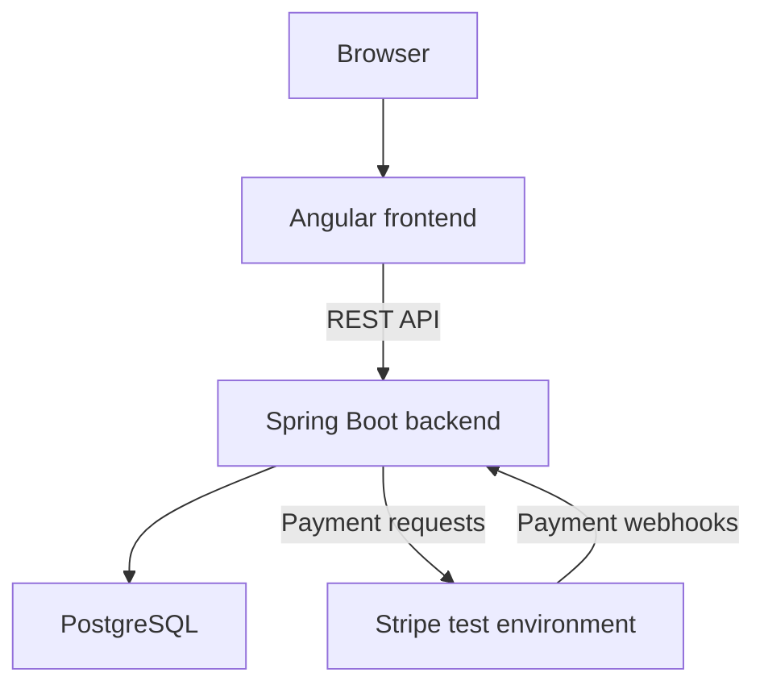

# multi-store-commerce

`multi-store-commerce` is a full-stack software engineering portfolio project for a multi-store commerce platform built around a fictional bakery.

The planned implementation uses Java, Spring Boot, Angular, PostgreSQL, and Docker. It will explore store-scoped authorization, product and inventory modeling, checkout, payment integration, webhook idempotency, and automated testing.

The project will start with a functional core and evolve incrementally. RabbitMQ, Redis, and WebSockets may be introduced when concrete requirements justify them.

> **Status:** Planning. Implementation has not started.
>
> This README describes the proposed architecture and development scope. It will be updated to reflect the implemented system.
>
> All payment processing will use Stripe's test environment.

## Architecture

The initial architecture consists of an Angular frontend, a Spring Boot modular monolith, and PostgreSQL.



The frontend will not access the database directly. Business rules, authorization, and persistence will be handled by the backend.

### Modular Monolith

The backend will initially be deployed as one application with explicit business module boundaries.

Proposed modules:

- Identity and access.
- Store.
- Catalog.
- Inventory.
- Cart.
- Order.
- Payment.
- Delivery.

Notifications and reporting may be introduced as additional modules.

A possible module structure is:

```text
order/
├── api/
├── application/
├── domain/
└── infrastructure/
```

The structure will remain pragmatic: abstractions should clarify responsibilities and support testing.

### Checkout and Payment

The intended flow is:

1. Select a store and add its products to a cart.
2. Submit checkout to the backend.
3. Validate prices, availability, stock, and customer input.
4. Create an order awaiting payment.
5. Initiate a payment through Stripe.
6. Receive and validate the Stripe webhook.
7. Process the event idempotently.
8. Update payment and order state.

A successful browser redirect will not be treated as proof of payment.

## Technology Stack

### Initial Scope

- Java and Spring Boot.
- Spring Web.
- Spring Security.
- Spring Data JPA and Hibernate.
- Bean Validation.
- Angular and TypeScript.
- PostgreSQL.
- Flyway or Liquibase — selection pending.
- Stripe test environment.
- OpenAPI.
- JUnit and Mockito.
- Docker and Docker Compose.

Versions will be specified when the initial applications are created.

### Possible Later Additions

- RabbitMQ for asynchronous processing.
- Redis for caching or temporary state.
- WebSockets for order status updates.

These technologies are roadmap candidates, not implemented dependencies.

## Domain Model

Proposed entities:

| Entity            | Responsibility                        |
| ----------------- | ------------------------------------- |
| Store             | Store identity and configuration      |
| User              | Authenticated identity                |
| StoreMembership   | Administrative access to stores       |
| Customer          | Customer information                  |
| Address           | Delivery address                      |
| Category          | Product classification                |
| Product           | Shared product information            |
| StoreProduct      | Store-specific price and availability |
| Inventory         | Stock associated with a store product |
| Cart / CartItem   | Shopping selections                   |
| Order / OrderItem | Purchase records and price snapshots  |
| Payment           | Payment state and provider references |
| Delivery          | Delivery information                  |

The initial model represents stores within one network. Support for unrelated businesses with separate tenancy boundaries is outside the initial scope.

### Core Rules

- Each cart belongs to one store.
- Products from different stores cannot be mixed in one cart.
- Each order belongs to one store.
- Checkout revalidates prices, availability, and stock.
- Order items preserve purchased prices and quantities.
- Administrative permissions are scoped to authorized stores.
- Invalid order state transitions must be rejected.

### Inventory Decisions

The implementation must define reservation timing, expiration, confirmation, and release.

Concurrency handling and payments completed after reservation expiration will be documented and tested.

## API

The following endpoints are proposals, not an implemented API contract:

| Method | Endpoint                             | Purpose                             |
| ------ | ------------------------------------ | ----------------------------------- |
| GET    | `/stores`                            | List stores                         |
| GET    | `/stores/{storeId}`                  | Retrieve a store                    |
| GET    | `/stores/{storeId}/products`         | Browse a store catalog              |
| POST   | `/stores/{storeId}/orders`           | Submit checkout and create an order |
| GET    | `/stores/{storeId}/orders/{orderId}` | Retrieve an authorized order        |
| POST   | `/webhooks/stripe`                   | Receive payment events              |

Authentication, cart management, and administrative endpoints will be defined during implementation.

The webhook endpoint will use Stripe signature verification rather than customer authentication. Order access will require ownership or appropriate administrative permissions.

The final contract will be documented through OpenAPI.

## Authentication and Authorization

Spring Security will enforce access control.

Proposed initial roles:

- `CUSTOMER`
- `STORE_MANAGER`
- `PLATFORM_ADMIN`

Authorization will consider both role and resource scope. A store manager must not gain access to another store by changing an identifier in a request.

JWT is under consideration. Token storage, expiration, renewal, and revocation policies remain to be defined.

## Payments and Idempotency

V1 will support card payments in Stripe's test environment.

Payment processing will account for:

- Signature verification.
- Duplicate webhook deliveries.
- Concurrent event processing.
- Failed processing and safe retries.
- Out-of-order events.
- Consistent payment and order updates.

An event must not be considered successfully processed solely because it was received.

Database constraints and transaction boundaries will protect against duplicate processing. The exact event tracking strategy will be documented in an ADR.

## Repository Structure

Proposed structure:

```text
multi-store-commerce/
├── backend/
├── frontend/
├── infrastructure/
├── docs/
│   ├── en/
│   ├── pt-BR/
│   └── adr/
├── docker-compose.yml
├── .env.example
├── README.md
└── README.pt-BR.md
```

## Configuration

The configuration contract will cover:

- Database connection settings.
- Stripe test credentials.
- Webhook signing secret.
- Authentication settings.
- Allowed frontend origins.
- Application URLs and environment settings.

An `.env.example` will document required variables without credentials.

Secrets and local `.env` files will remain outside version control.

## Running Locally

The initial Docker Compose environment will include:

- Frontend.
- Backend.
- PostgreSQL.

The target workflow is:

```sh
docker compose up --build
```

This command is a development goal and is not available yet.

Installation steps, ports, migrations, seed data, and test payment instructions will be added once the environment is functional.

## Tests

The planned suite will include unit, integration, API, and frontend tests.

Important scenarios:

- Customers cannot access administrative operations.
- Store managers cannot administer unauthorized stores.
- Carts reject products from other stores.
- Checkout rejects unavailable products.
- Concurrent checkout respects stock rules.
- Invalid webhook signatures are rejected.
- Duplicate events do not duplicate order updates.
- Failed event processing can be retried safely.
- Invalid order transitions are rejected.

Test commands and infrastructure requirements will be documented alongside the implementation.

## Internal Documentation

Planned documentation:

- Architecture and module boundaries.
- Domain model and database relationships.
- Docker development environment.
- API and payment flows.
- Test guide.
- Architecture Decision Records.

Documentation links will be added as the corresponding files are created.

## Roadmap

### V1 — Core Platform

- Store and catalog.
- Authentication and store-scoped authorization.
- Cart and checkout.
- Orders and inventory consistency.
- Stripe test card payments.
- Basic administration.
- Migrations, tests, and Docker environment.

### V2 — Asynchronous Processing

Evaluate RabbitMQ for notifications and other asynchronous workloads.

Define event delivery guarantees and consistency between database changes and message publication before implementation.

### V3 — Caching

Evaluate Redis for identified performance or temporary-state requirements.

Document expiration, invalidation, and fallback behavior.

### V4 — Real-Time Updates

Evaluate WebSockets for order tracking, including authorization of subscriptions and reconnection behavior.

## Trade-offs

- A modular monolith simplifies deployment and debugging but requires disciplined module boundaries.
- Store-aware modeling introduces complexity before multiple stores are populated, while avoiding assumptions that every operation belongs to one global store.
- A shared PostgreSQL database simplifies initial persistence but requires consistent enforcement of store scope.
- Local Docker Compose supports reproducibility; it does not demonstrate production availability or scalability.
- Payment integration requires handling failures and duplicate events across system boundaries.
- Messaging and caching will be introduced for concrete use cases, with their operational costs documented.
- Scalability is a design consideration, not a validated claim at this stage.

## Author

Júnio Rosa

[LinkedIn](https://www.linkedin.com/in/j%C3%BAnio-rosa-94b5731b2/)

## License

This project is licensed under the MIT License. See [LICENSE](LICENSE) for details.
