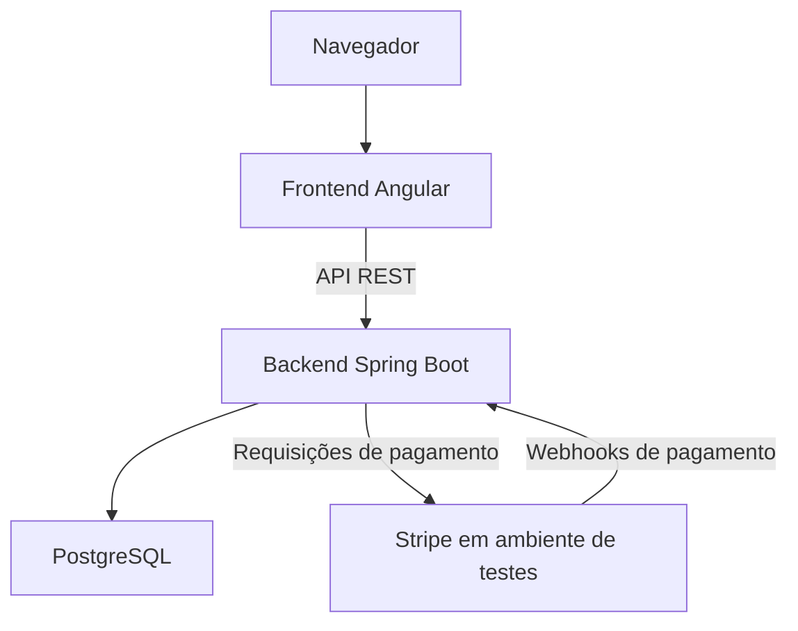

# multi-store-commerce

`multi-store-commerce` é um projeto de portfólio de engenharia de software full stack para uma plataforma de comércio multi-loja, utilizando uma rede fictícia de padarias como domínio.

A implementação planejada utiliza Java, Spring Boot, Angular, PostgreSQL e Docker. O projeto abordará autorização por loja, modelagem de produtos e estoque, checkout, pagamentos, idempotência de webhooks e testes automatizados.

O desenvolvimento começará com um núcleo funcional e evoluirá incrementalmente. RabbitMQ, Redis e WebSockets poderão ser introduzidos quando requisitos concretos justificarem sua adoção.

> **Status:** Planejamento. A implementação ainda não começou.
>
> Este README descreve a arquitetura proposta e o escopo de desenvolvimento. Será atualizado para refletir o sistema implementado.
>
> Todos os pagamentos utilizarão o ambiente de testes da Stripe.

## Arquitetura

A arquitetura inicial consiste em um frontend Angular, um monólito modular Spring Boot e PostgreSQL.



O frontend não acessará o banco diretamente. Regras de negócio, autorização e persistência serão tratadas pelo backend.

### Monólito Modular

O backend será inicialmente implantado como uma aplicação com limites explícitos entre módulos de negócio.

Módulos propostos:

- Identidade e acesso.
- Loja.
- Catálogo.
- Estoque.
- Carrinho.
- Pedido.
- Pagamento.
- Entrega.

Notificações e relatórios poderão ser introduzidos como módulos adicionais.

Uma possível organização interna:

```text
order/
├── api/
├── application/
├── domain/
└── infrastructure/
```

A estrutura permanecerá pragmática: abstrações devem esclarecer responsabilidades e facilitar testes.

### Checkout e Pagamento

O fluxo pretendido será:

1. Selecionar uma loja e adicionar seus produtos ao carrinho.
2. Enviar o checkout ao backend.
3. Validar preços, disponibilidade, estoque e dados do cliente.
4. Criar um pedido aguardando pagamento.
5. Iniciar um pagamento pela Stripe.
6. Receber e validar o webhook da Stripe.
7. Processar o evento de forma idempotente.
8. Atualizar o pagamento e o pedido.

Um redirecionamento bem-sucedido do navegador não será considerado comprovação de pagamento.

## Stack de Tecnologias

### Escopo Inicial

- Java e Spring Boot.
- Spring Web.
- Spring Security.
- Spring Data JPA e Hibernate.
- Bean Validation.
- Angular e TypeScript.
- PostgreSQL.
- Flyway ou Liquibase — escolha pendente.
- Ambiente de testes da Stripe.
- OpenAPI.
- JUnit e Mockito.
- Docker e Docker Compose.

As versões serão especificadas quando as aplicações iniciais forem criadas.

### Possíveis Adições Futuras

- RabbitMQ para processamento assíncrono.
- Redis para cache ou estados temporários.
- WebSockets para atualizações de pedidos.

Essas tecnologias fazem parte do roadmap proposto e ainda não são dependências implementadas.

## Modelo de Domínio

Entidades propostas:

| Entidade          | Responsabilidade                              |
| ----------------- | --------------------------------------------- |
| Store             | Identificação e configuração da loja          |
| User              | Identidade autenticada                        |
| StoreMembership   | Acesso administrativo às lojas                |
| Customer          | Informações do cliente                        |
| Address           | Endereço de entrega                           |
| Category          | Classificação de produtos                     |
| Product           | Informações compartilhadas do produto         |
| StoreProduct      | Preço e disponibilidade por loja              |
| Inventory         | Estoque associado ao produto da loja          |
| Cart / CartItem   | Seleções de compra                            |
| Order / OrderItem | Registros da compra e preços adquiridos       |
| Payment           | Estado do pagamento e referências do provedor |
| Delivery          | Informações da entrega                        |

O modelo inicial representa unidades de uma mesma rede. O isolamento completo entre empresas independentes está fora do escopo inicial.

### Regras Centrais

- Cada carrinho pertence a uma loja.
- Um carrinho não mistura produtos de lojas diferentes.
- Cada pedido pertence a uma loja.
- O checkout revalida preços, disponibilidade e estoque.
- Os itens do pedido preservam os preços e as quantidades adquiridos.
- Permissões administrativas respeitam o escopo das lojas autorizadas.
- Transições inválidas de pedido devem ser rejeitadas.

### Decisões de Estoque

A implementação deverá definir os momentos de reserva, expiração, confirmação e liberação de estoque.

O tratamento de concorrência e de pagamentos concluídos após a expiração da reserva será documentado e testado.

## API

Os endpoints abaixo são propostas, não um contrato de API implementado:

| Método | Endpoint                             | Finalidade                       |
| ------ | ------------------------------------ | -------------------------------- |
| GET    | `/stores`                            | Listar lojas                     |
| GET    | `/stores/{storeId}`                  | Consultar uma loja               |
| GET    | `/stores/{storeId}/products`         | Consultar o catálogo da loja     |
| POST   | `/stores/{storeId}/orders`           | Realizar checkout e criar pedido |
| GET    | `/stores/{storeId}/orders/{orderId}` | Consultar um pedido autorizado   |
| POST   | `/webhooks/stripe`                   | Receber eventos de pagamento     |

Endpoints de autenticação, carrinho e administração serão definidos durante a implementação.

O webhook utilizará verificação de assinatura da Stripe em vez de autenticação de cliente. O acesso a pedidos exigirá titularidade ou permissão administrativa adequada.

O contrato definitivo será documentado com OpenAPI.

## Autenticação e Autorização

O Spring Security aplicará os controles de acesso.

Papéis iniciais propostos:

- `CUSTOMER`
- `STORE_MANAGER`
- `PLATFORM_ADMIN`

A autorização considerará o papel e o escopo do recurso. Um gerente não poderá acessar outra loja apenas alterando um identificador na requisição.

JWT está em consideração. Armazenamento, expiração, renovação e revogação de tokens ainda serão definidos.

## Pagamentos e Idempotência

A V1 aceitará pagamentos com cartão no ambiente de testes da Stripe.

O processamento considerará:

- Verificação de assinatura.
- Entregas duplicadas de webhooks.
- Processamento concorrente de eventos.
- Falhas e retentativas seguras.
- Eventos fora de ordem.
- Atualização consistente de pagamentos e pedidos.

Um evento não será considerado processado com sucesso apenas porque foi recebido.

Restrições no banco e limites transacionais protegerão contra processamento duplicado. A estratégia de registro dos eventos será documentada em um ADR.

## Estrutura do Repositório

Estrutura proposta:

```text
multi-store-commerce/
├── backend/
├── frontend/
├── infrastructure/
├── docs/
│   ├── en/
│   ├── pt-BR/
│   └── adr/
├── docker-compose.yml
├── .env.example
├── README.md
└── README.pt-BR.md
```

## Configuração

O contrato de configuração abrangerá:

- Conexão com o banco.
- Credenciais de teste da Stripe.
- Segredo de assinatura de webhooks.
- Configurações de autenticação.
- Origens permitidas do frontend.
- URLs das aplicações e configurações de ambiente.

Um `.env.example` documentará as variáveis necessárias sem credenciais.

Segredos e arquivos `.env` locais permanecerão fora do controle de versão.

## Executando Localmente

O ambiente inicial do Docker Compose conterá:

- Frontend.
- Backend.
- PostgreSQL.

O fluxo pretendido será:

```sh
docker compose up --build
```

Esse comando representa um objetivo de desenvolvimento e ainda não está disponível.

Instruções de instalação, portas, migrations, dados iniciais e pagamentos de teste serão adicionadas quando o ambiente estiver funcional.

## Testes

A suíte planejada incluirá testes unitários, de integração, de API e de frontend.

Cenários importantes:

- Clientes não acessam operações administrativas.
- Gerentes não administram lojas sem autorização.
- Carrinhos rejeitam produtos de outras lojas.
- O checkout rejeita produtos indisponíveis.
- Compras concorrentes respeitam o estoque.
- Assinaturas inválidas de webhook são rejeitadas.
- Eventos duplicados não duplicam atualizações de pedidos.
- Falhas no processamento permitem retentativas seguras.
- Transições inválidas de pedido são rejeitadas.

Comandos e requisitos de infraestrutura dos testes serão documentados junto com a implementação.

## Documentação Interna

Documentação planejada:

- Arquitetura e limites dos módulos.
- Modelo de domínio e relacionamentos do banco.
- Ambiente de desenvolvimento com Docker.
- API e fluxos de pagamento.
- Guia de testes.
- Registros de Decisões Arquiteturais.

Os links serão adicionados conforme os arquivos forem criados.

## Roadmap

### V1 — Plataforma Principal

- Loja e catálogo.
- Autenticação e autorização por loja.
- Carrinho e checkout.
- Pedidos e consistência de estoque.
- Pagamentos com cartão em ambiente de testes.
- Administração básica.
- Migrations, testes e ambiente Docker.

### V2 — Processamento Assíncrono

Avaliar RabbitMQ para notificações e outros processos assíncronos.

Definir garantias de entrega e consistência entre alterações no banco e publicação de mensagens antes da implementação.

### V3 — Cache

Avaliar Redis para necessidades identificadas de desempenho ou estados temporários.

Documentar expiração, invalidação e comportamento em caso de indisponibilidade.

### V4 — Atualizações em Tempo Real

Avaliar WebSockets para acompanhamento de pedidos, incluindo autorização das assinaturas e comportamento de reconexão.

## Trade-offs

- O monólito modular simplifica implantação e depuração, mas exige disciplina nos limites entre módulos.
- A modelagem por loja acrescenta complexidade antes de cadastrar várias unidades, enquanto evita pressupor que todas as operações pertencem a uma única loja global.
- Um PostgreSQL compartilhado simplifica a persistência inicial, mas exige aplicação consistente do escopo de acesso.
- Docker Compose local facilita reprodução do ambiente; não comprova disponibilidade ou escalabilidade em produção.
- Pagamentos exigem tratamento de falhas e eventos duplicados entre sistemas.
- Mensageria e cache serão introduzidos para casos concretos, com seus custos operacionais documentados.
- Escalabilidade é uma consideração de design, ainda não uma capacidade validada.

## Autor

Júnio Rosa

[LinkedIn](https://www.linkedin.com/in/j%C3%BAnio-rosa-94b5731b2/)

## Licença

Este projeto está licenciado sob a licença MIT. Consulte [LICENSE](LICENSE) para mais detalhes.
